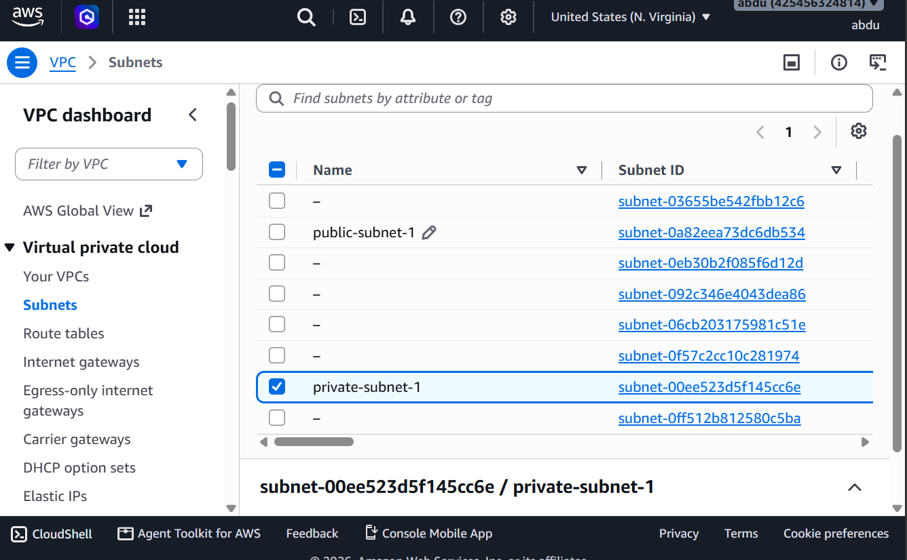
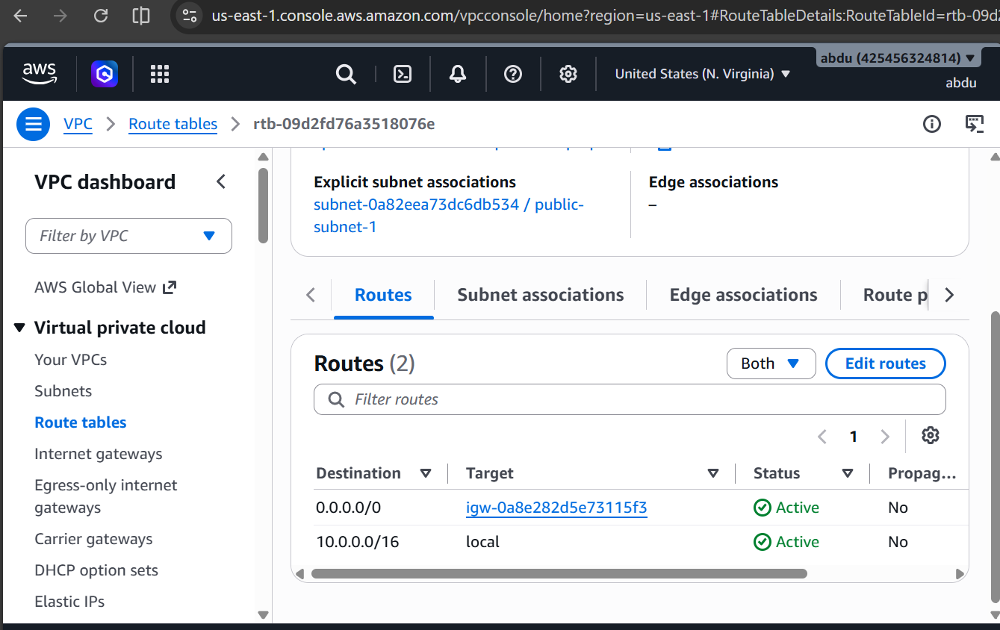
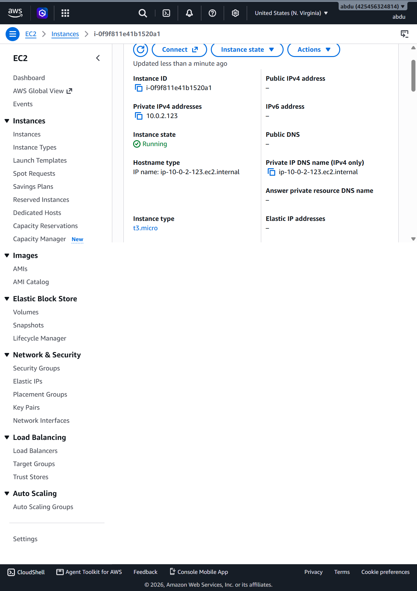

# Session 7: Building a Custom 2-Tier VPC Architecture in AWS

## Overview
Designed and provisioned a custom Virtual Private Cloud (VPC) from scratch in AWS to host a secure 2-tier application architecture.

## Network Architecture

### Key Specifications:
- **VPC:** `bootcamp-vpc` (`10.0.0.0/16`)
- **Public Subnet:** `public-subnet-1` (`10.0.1.0/24`) in `us-east-1a`
- **Private Subnet:** `private-subnet-1` (`10.0.2.0/24`) in `us-east-1b`
- **Internet Gateway:** `bootcamp-igw` attached to `bootcamp-vpc`

## Verification & Testing
1. **Public Web Server (`public-web-server`):** Launched in `public-subnet-1` with auto-assign public IP enabled. Verified direct internet access and assigned public IP.
2. **Private Database Server (`private-database-server`):** Launched in `private-subnet-1` with public IP disabled. Verified complete network isolation from the internet.

## Key Takeaways
- Learned why subnet separation is critical for secure production workloads.
- Mastered route table evaluation rules (`0.0.0.0/0` targeting IGW vs. local traffic).

## 📷 Visual Verification & Screenshots

### 1. Custom VPC Subnets

### 2. Public Internet Gateway Routing (`0.0.0.0/0`)

### 3. Public Web Server (Assigned Public IPv4)

### 4. Private Database Server (No Public IPv4 - Isolated)
